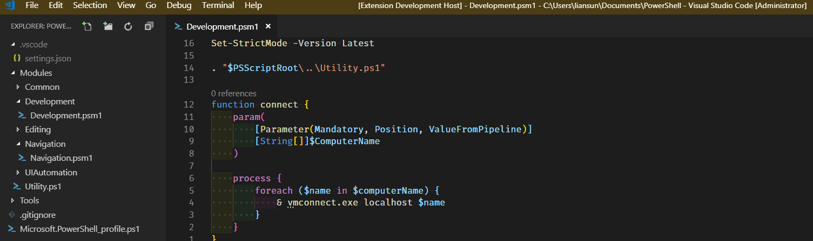

# Quick Notes

## Features

Press alt+` to toggle the notes file. Notes file will be created if it doesn't exist.

## Extension Settings

* `quicknotes.fileName`: specify notes file name (default: ./.vscode/notes.txt).