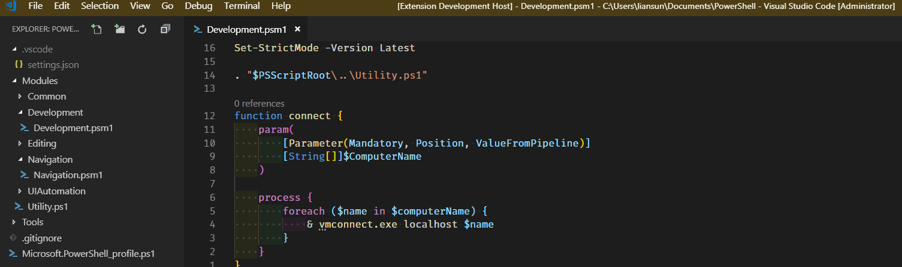

# Introduction

## Press alt+` on Windows or alt+tab on Mac to toggle the notes file. Notes file will be created if it doesn't exist.

## Settings

* `quickNotes.fileName`: specify notes file name (default: ./.vscode/notes.txt).